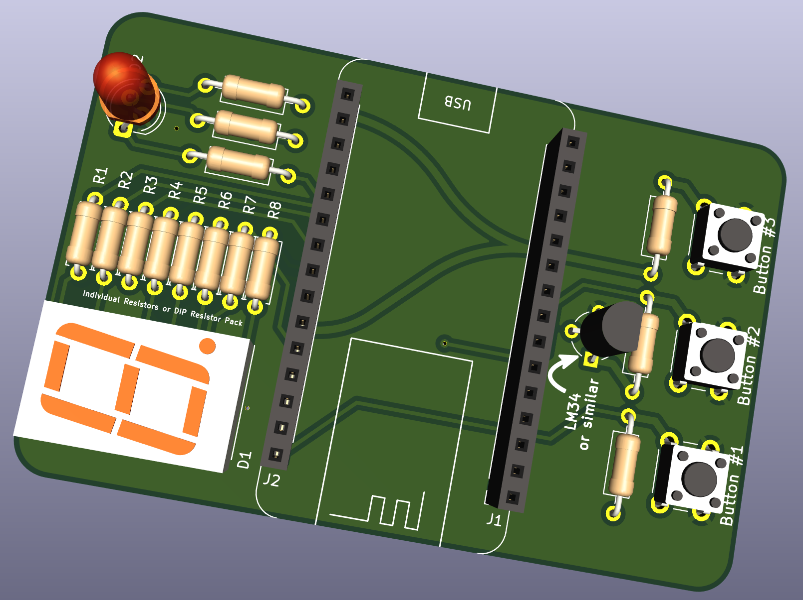
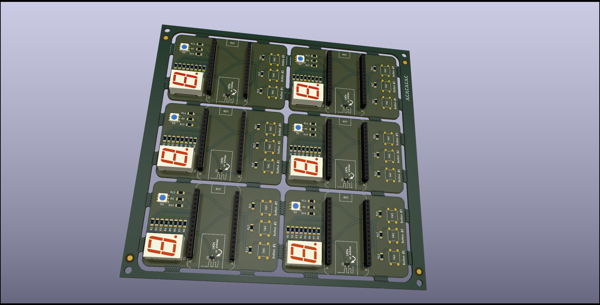

# NOTE: This is a pre-release of the shield/daughterboard, and it's still in development (mainly docs). 

# E707 Basic NodeMCU-V2 Shield 

This shield/daughterboard is for the NodeMCU V2 (also known as NodeMCU DevKit V1.0, kind of confusing) to allow a begineer to have some components to play around with. In this case, that includes a 7-segment display, an RGB LED (which is hooked up with the 7-segment display), and 3 pushbuttons.

### Arduino Library

The Arduino library for this shield can be found at: [https://github.com/Electro707/Basic-NodeMCUV2-Dev-Shield-Library](https://github.com/Electro707/Basic-NodeMCUV2-Dev-Shield-Library). It provides pin definitions and more importantly some examples to get started with.

The reason it's in a different repo is to allow for an easy download of the library as a ZIP file (using GitHub's "Download ZIP" option) to be easily imported into the Arduino IDE. 

### PCB

The PCB files can be found in the `KiCAD Files` folder. 

There are different folders for different PCB layouts. More details can be found in [KiCAD_Files/README.md](KiCAD_Files/README.md)

#### PCB Panel

There is a panel (not tested tough) of the PCB for mass-production:

##### NOTE: If you have KiCAD 5.1.9 or lower, the KiCAD files will not open as it was designed with KiCAD 5.99 (the alpha/beta version of KiCAD V6).

### Docs 
Coming Soon!

### Credits:
- Creator and Maintainer:
    - Electro707 (Jamal Bouajjaj)
- KiCAD NODEMCU V2 Symbol:
    - jdunmire -> [https://github.com/jdunmire/kicad-ESP8266](https://github.com/jdunmire/kicad-ESP8266)
- Some Icons:
    - Arduino's IDE Repo -> [https://github.com/arduino/Arduino/blob/master/build/shared/lib/theme/buttons.svg](https://github.com/arduino/Arduino/blob/master/build/shared/lib/theme/buttons.svg)
